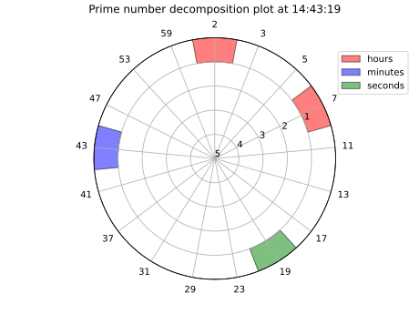
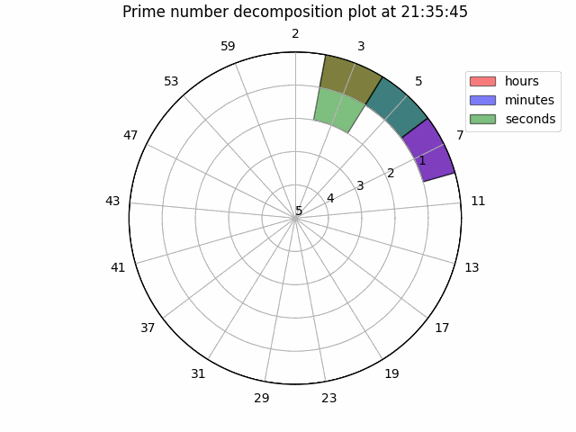
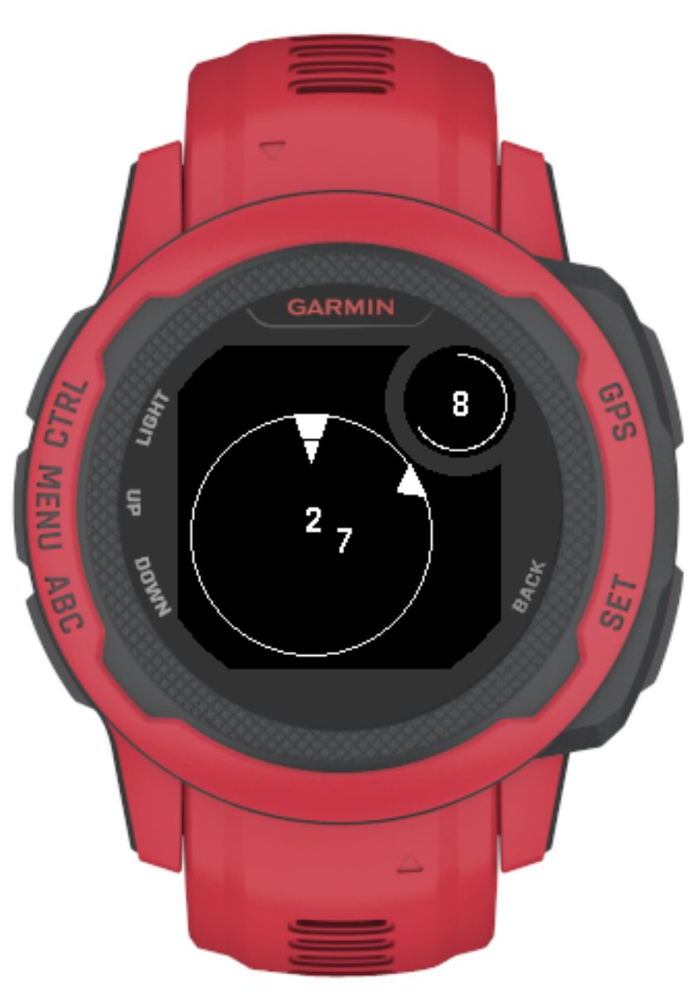

Small Python CLI script to make a polar plot of the current time in HH:MM:SS, but making a prime decomposition of each number. Meant as a POC for the concept of a watch face.

 \
Example plot of the time. Each number is represented by its prime decomposition and plotted on a polar plot, where *theta* shows the prime factor and *r* counts amount of factors of this prime in the number

 \
Example of the clock running for 10 seconds.

The watchface is also implemented for a Garmin Instinct 2S smartwatch, see the *prime_time* subfolder and its readme for more info.

The image below shows the Garmin watchface at 8:28
 \